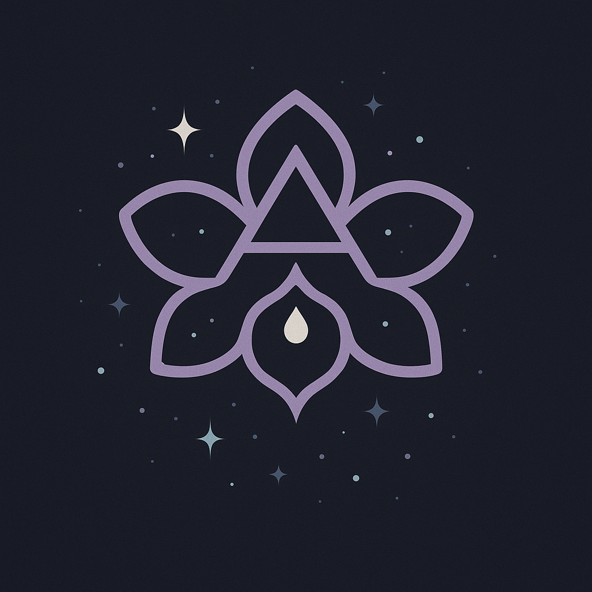
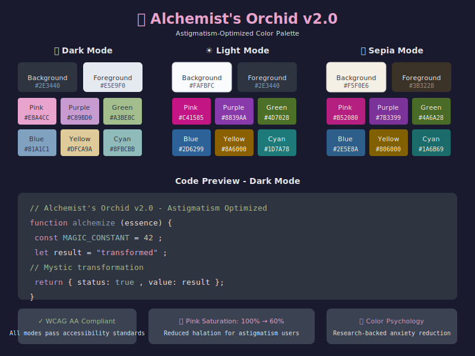

# Alchemist's Orchid

  

> "Inspired by the crisp hues of the Arctic, Alchemist's Orchid melds that serene coolness with soft purples and pinks for an enchanting, pastel-infused palette — now optimized for visual accessibility."

A versatile color palette crafted for any terminal emulator or editor, with **astigmatism-friendly design** and **anxiety-reducing color psychology**.

---

## 🌟 What's New in v2.0

- **🔬 Astigmatism-Optimized**: Reduced saturation on high-intensity colors to prevent halation blooming
- **☀️ Light Mode**: Essential for users who experience discomfort with dark interfaces
- **📜 Sepia Mode**: Warm tones for extended coding sessions
- **📊 WCAG AA Compliant**: All color combinations pass accessibility standards

---

## 🌌 Features

* **Arctic Inspiration**: Hints of cool, muted blues against a dark backdrop
* **Pastel Twist**: Gentle pinks and purples bring a soothing, magical vibe
* **Anxiety-Reducing**: Purple and pink tones backed by color psychology research
* **Cross-Platform**: Use in Windows Terminal, iTerm2, VSCode, Hyper, or any theme-aware application
* **High Contrast & Legibility**: Dark background balanced by bright, clear foregrounds
* **Astigmatism-Friendly**: Optimized saturation levels to reduce halation effects
* **Three Modes**: Dark, Light, and Sepia variants included

---

## 🎨 Color Palettes

### Dark Mode (Default)

Optimized for reduced halation with lower saturation on accent colors.

| Element    | Hex       | Description           | Saturation |
| ---------- | --------- | --------------------- | ---------- |
| Background | `#2E3440` | Deep Arctic Night     | -          |
| Foreground | `#E5E9F0` | Soft Snowfall         | -          |
| Cursor     | `#D9A8DD` | Alchemical Catalyst   | 40%        |
| Pink       | `#E8A4CC` | Pastel Bloom          | 60%        |
| Green      | `#A3BE8C` | Frosted Fern          | 28%        |
| Yellow     | `#DFCA9A` | Golden Dusk           | 52%        |
| Blue       | `#81A1C1` | Nordic Sky            | 34%        |
| Purple     | `#C89BD0` | Mystic Rune           | 36%        |
| Cyan       | `#8FBCBB` | Glacial Stream        | 25%        |

### Light Mode

Higher saturation for visibility on light backgrounds.

| Element    | Hex       | Description           |
| ---------- | --------- | --------------------- |
| Background | `#FAFBFC` | Frosted Glass         |
| Foreground | `#2E3440` | Deep Arctic Night     |
| Cursor     | `#B266B2` | Orchid Heart          |
| Pink       | `#C41585` | Deep Bloom            |
| Green      | `#4D7028` | Forest Fern           |
| Yellow     | `#8A6000` | Amber Dusk            |
| Blue       | `#2D6299` | Ocean Depth           |
| Purple     | `#8839AA` | Royal Rune            |
| Cyan       | `#1D7A78` | Deep Stream           |

### Sepia Mode

Warm tones for extended sessions and reduced blue light.

| Element    | Hex       | Description           |
| ---------- | --------- | --------------------- |
| Background | `#F5F0E6` | Warm Parchment        |
| Foreground | `#3B3228` | Aged Ink              |
| Cursor     | `#A35BA3` | Dusty Orchid          |
| Pink       | `#B52080` | Rose Thorn            |
| Green      | `#4A6A28` | Sage Leaf             |
| Yellow     | `#806000` | Antique Gold          |
| Blue       | `#2E5E8A` | Vintage Indigo        |
| Purple     | `#7B3399` | Plum Wine             |
| Cyan       | `#1A6B69` | Patina                |

  

---

## 🔬 Accessibility Research

### Why These Changes Matter

**Astigmatism affects ~50% of the population.** When viewing dark interfaces, pupils dilate, causing the irregularly-shaped cornea to create a "halation" effect where light text appears to bleed into dark backgrounds.

**Our solution:**
- Reduced saturation on high-intensity colors (Pink: 100% → 60%)
- Avoided pure black (#000) and pure white (#FFF)
- Provided light and sepia alternatives

### Color Psychology

Our purple/pink palette is backed by research:
- **Pink**: Tranquilizing effect within minutes; reduces anxiety and aggression
- **Purple**: Decreases amygdala (fear center) activity
- **Blue**: Associated with calm and security
- **Green**: Easiest color for human eyes to perceive

[Read the full research report →](docs/RESEARCH.md)

---

## 🚀 Installation

### Windows Terminal

See [`apps/windows-terminal/README.md`](apps/windows-terminal/README.md) for detailed steps.

**Quick install:**
1. Open Windows Terminal settings
2. Copy the contents of your preferred theme from `apps/windows-terminal/`
3. Paste into the `"schemes"` array
4. Set your profile's `"colorScheme"` to `"Alchemist's Orchid v2.0 Dark"` (or Light/Sepia)

### VS Code

Coming soon! Contributions welcome.

### iTerm2

Coming soon! Contributions welcome.

### Other Platforms

Import the hex values into your preferred configuration. All three palettes are available in JSON format.

---

## ✨ Customization

The palette is designed with flexibility in mind:

* **For dark mode users with astigmatism**: Try increasing font size and line height
* **If halation persists**: Switch to Light or Sepia mode
* **For OLED displays**: Consider Light mode — OLED's perfect blacks can intensify halation

---

## 📊 WCAG Compliance

All color combinations meet WCAG AA standards (4.5:1 minimum contrast ratio).

| Mode  | Main Text | Rating |
|-------|-----------|--------|
| Dark  | 10.26:1   | AAA    |
| Light | 12.06:1   | AAA    |
| Sepia | 11.05:1   | AAA    |

---

## 🤝 Contributing

Pull requests, variations, and issue reports are welcome!

**Especially seeking:**
- VS Code theme implementation
- iTerm2 configuration
- Vim/Neovim colorscheme
- JetBrains IDE theme
- Accessibility testing feedback

---

## 📚 Documentation

- [Research Report](docs/RESEARCH.md) - Deep dive into color psychology and accessibility
- [Changelog](CHANGELOG.md) - Version history
- [Windows Terminal Setup](apps/windows-terminal/README.md) - Installation guide

---

## 📄 License

Released under the [MIT License](LICENSE).

---

  <em>"A colorscheme should make your eyes rest, not work."</em>

  Made with 💜 for developers who care about their eyes

